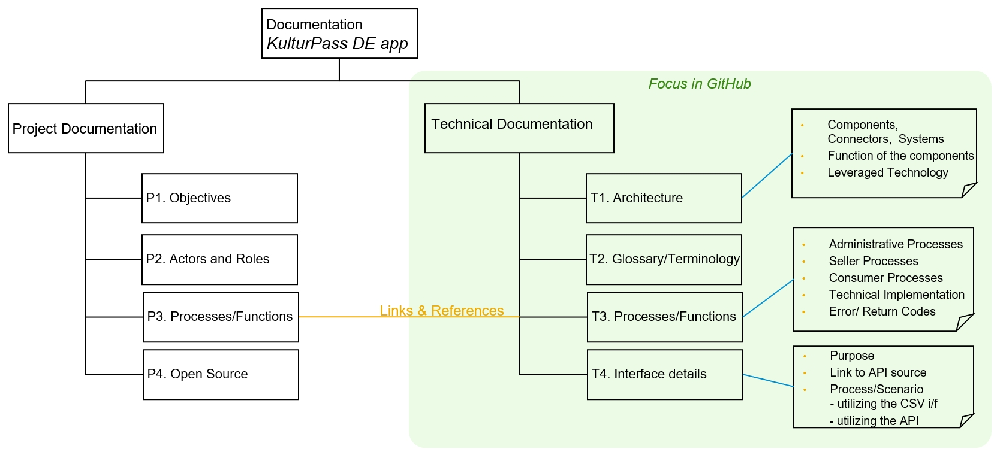

    

# Project documentation _KulturPass DE_ 

This place bundles the currently available documentation for the German _KulturPass DE_ project. 

**_Please note:_** This documentation is subject of change. We expect the documentation will evolve on a daily basis, especially at the beginning of the project. It is our target to provide transparent information and insight for the project, even at an early stage of design and development of the KulturPass project.

## About this project

"We want to get young people excited about the wide variety of culture in our country".

The KulturPass project in Germany is implemented by resolution of the German Bundestag and is the responsibility of the Federal Government Commissioner for Culture and the Media (BKM). The main objective of the project is compensation in both ways: On the one hand to support the cultural community in the broadest sense; artists, agencies, stages, and cultural providers, and on the other hand to motivate, encourage, and inspire young interested people to actively discover, experience, and explore culture and art. To achieve this goal, with the KulturPass project we aim to create a "cultural marketplace" with offerings for the youth. Those cultural offers can be found and reserved leveraging a KulturPass app on the smartphone with a monetary budget funded by the German government. 

## Who We Are

Driven by the German government, the project is managed by the [foundation "Digitale Chancen"](https://www.digitale-chancen.de/), which is responsible for content and community management. SAP and its technical partners have been entrusted with the implementation and operation of the technical solution. Based on the experience of former projects and with the engagement of strong partners, we aim to set up and deliver a scalable, reliable state-of-the-art product for the marketplace and an attractive, easy-to-use mobile app for the young users.

## Working Language

Even if the _KulturPass DE_ project will be implemented for the German market, implementation is perfomed by an international team of developers, architects and other expert roles. As we want to act as open and transparent as possible for interested parties in the global developer community who do not speak German, the technical content here comes primarily in English language - especially on coding level. 

Obviously, the mobile application itself, its documentation and all end-user facing content will be provided in German. 
We also try to make major articles of the developer documentation available in German, but we decided to stay on the Lingua Franca of the global developer community making English the leading language for the technial part of the documentation.

## Credits

Many thanks to all contributors who are actively engaged in the _KulturPass DE_ project. The result and the success of our project relies on the close and open collaboration as well as on the support by these parties.
Many partner and service providers added valuable input either on the content side or with dedicated expertise on the business areas and commonly-used processes and interfaces. Thoses partners are crucial for the design and implementation of our solution, so their input is highly appreciated.
Last but not least, no project could gain that kind of attention and visibility without all the engaged individuals that contribute with feedback, comments, questions, and proposals for enhancements, fixes and additonal options to solve open issues. Many thanks to you, folks!

## Data Privacy

In this project we are strictly observing the principles of the General Data Protection Regulation (GDPR) to protect the users’ privacy. We are processing necessary data only to fulfill the addressed tasks and actions of the users (authorization, scanning the offers, purchasing process etc.) Compliance with data safety and privacy regulations is safeguarded by several procedures, e.g. by implementing technical and organizational measures adhering diligently to the high standards of the GDPR. To always be as clear and as transparent as possible, the end user app will provide users with a comprehensive privacy statement.
 
As we are developing the solution, major parts of the enduser app will be implemented as an open source project, so the community can review the documentation and the respective designs, architecture and coding. We welcome your feedback here! 

However, please understand and accept, that the Open Source approach is limited due to the utilization of commercial business software either from SAP or from other software vendors, especially concerning the backend services and the marketplace customization.

## Code of Conduct

This project has adopted the Contributor Covenant in version 2.1 as our code of conduct. Please see the details in our [CODE_OF_CONDUCT.md](CODE_OF_CONDUCT.md). All contributors must abide by the code of conduct.

## How to Contribute

Please see our [CONTRIBUTING.md](CONTRIBUTING.md) for details on how to contribute, our team setup, the project structure and additional details which you need to know to work with us.
We also ask all interested people to use English as language to create issues in their code (comments, documentation etc.), and when you send requests to us.

## Structure of our documentation

This repository contains the developer documentation and related content. Please note, while the documentation addresses two areas (the project and the technical topics), this documentation repository will focus on the technical architecture and implementation:

The [Project Documentation](project-documentation/README.md) will provide a brief introduction to the KulturPass project. This introduction shall give you an understanding about the "embedding" of the KulturPass DE app. With the given context you might get a better understanding of the actors and roles, the involved parties and the running components in the background. We also address the open source approach for the project in that chapter.

Major focus, however, is the [Technical Documentation](technical-documentation/README.md) of our KulturPass app. This chapter provides a deeper insight into the "How to" of the architecture, design, and implementation of the app. You will find real coding, diagrams, test samples, and other artefacts for the KulturPass app here. It is our mission to be as transparent and open as possible during the development process and to gain trust of our valuable community.  

### Project documentation

For KulturPass DE the scope of the project was jointly agreed between the Federal Government Commissioner for Culture and the Media (_Die Beauftragte der Bundesregierung für Kultur und Medien_), the [foundation _Digitale Chancen_](https://www.digitale-chancen.de/) (which conducts the project operationally) and the implementation contractors including SAP. In our documentation we will give a brief introduction about the scope and objectives, on the different parties and the major roles on the cultural marketplace. This leads directly to the interaction between the parties, to the targeted processes and functions of the KulturPass project. 

We appreciate any feedback to all elements of this project scope document; questions, hints, remarks, proposals, feedback, and recommendations, even new use cases or feature requests from our community are welcome! We do our best to consolidate, discuss, prioritize and document them in the product review cycles to address your opinions accordingly.

However, in GitHub you will not find information about political, financial or marketing contexts. For those details you may check the [KulturPass website](https://www.kulturpass.de) or the respective public media and news services.

The project documentation will be continuously updated in the following documents:

* [KulturPass DE - Project Scope & Objectives](project-documentation/project-objectives.md)
* [KulturPass DE - Relevant Actors and Roles](project-documentation/project-roles-and-actors.md)
* [KulturPass DE - Processes for Vendors and Consumers](project-documentation/project-processes-and-functions.md)
* [KulturPass DE - Open Source Precepts](project-documentation/project-open-source.md)

### Technical Documentation

Major focus of this GitHub project is the technical documentation for the KulturPass project in Germany. Here we describe the architecture, design and implementation of the consumer component - the KulturPass app. Please understand that it is neither technically possible nor legally permitted to disclose implementation details or internal configurations of the leveraged commercial backend solutions and products, though.

The below-mentioned technical documents are intended to provide in-depth details for a technical community. We try our best that this documentation represents the most recent state of the architecture, design and implementation. Based on picture given by the _Project Documentation_ (see above) we start with documenting the high-level architecture and the technical components. This architecture and the underlying concepts might change or evolve over time for various reasons (legal or technological dependencies, changing or new requirements, new actors/processes/use cases etc.)
Since we expect a bunch of abbreviations, we will also create a glossary - see below. 

Again: We appreciate any feedback to all elements of this project scope document; questions, hints, remarks, proposals, feedback, and recommendations, even new use cases or feature requests from our community are welcome! We do our best to consolidate, discuss, prioritize and document them in the product review cycles to address your opinions accordingly.

The technical documentation will be a collection of documents referring to each other and as well referring to documents in the _Project Documentation_ (see above):

* [KulturPass DE - Architecture](technical-documentation/technical-architecture-01.md)
  * [User Identification Concept](technical-documentation/user-identification-concept.md)
  * [User Identification with eID](technical-documentation/user-identification-with-eid.md)
* [KulturPass DE - Processes and Functions](technical-documentation/technical-processes-and-functions.md)
* [KulturPass DE - Interface Details](technical-documentation/technical-interfaces.md)

### Glossary

For an easier understanding of the used acronyms and special terms in our documents please see our [glossary](glossary.md).

## Licensing

Copyright (c) 2023 SAP SE or an SAP affiliate company and kulturpass-de contributors.

Licensed under the Apache License, Version 2.0 (the "License"); you may not use this file except in compliance with the License.

You may obtain a copy of the License at https://www.apache.org/licenses/LICENSE-2.0.

Unless required by applicable law or agreed to in writing, software distributed under the License is distributed on an "AS IS" BASIS, WITHOUT WARRANTIES OR CONDITIONS OF ANY KIND, either express or implied. See the LICENSE for the specific language governing permissions and limitations under the License.

The "KulturPass" logo is copyright (c) 2023 by the Federal Government Commissioner for Culture and the Media (BKM). It is currently being registered at the German Patent and Trade Mark Office (DPMA). For more information please see [bundesregierung.de](https://www.bundesregierung.de).
