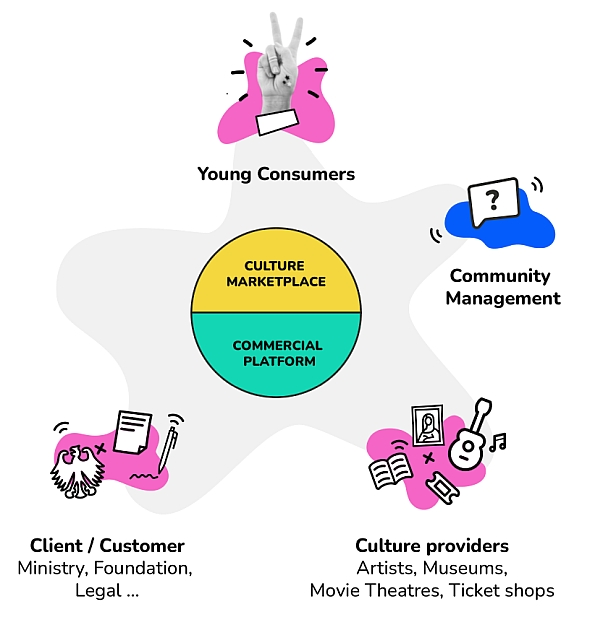

# KulturPass app - Scope and Objectives
## German

Jungen Menschen aus allen Gesellschaftsschichten einen möglichst offenen und breiten Zugang zur Kultur zu ermöglichen, ist ein zentrales kulturpolitisches Anliegen. Gleichzeitig gilt es, die reduzierte Nachfrage im Kulturbereich nach der Corona-Pandemie wieder anzukurbeln. Vor diesem Hintergrund hat der Deutsche Bundestag am 10. November 2022 die Einführung eines bundesweiten KulturPasses beschlossen.

Der KulturPass führt junge Menschen und Kulturanbieter auf einem digitalen Marktplatz mit eigener Web-Plattform und mobiler App zusammen. Für die Kulturanbieter bedeutet dies einen Nachfrageschub und den direkten Zugang zum Publikum von morgen, für die jungen Menschen wird ein neuer Zugang und Anreiz für Kulturerlebnisse ermöglicht.

Über die KulturPass-App können die Nutzerinnen und Nutzer bundesweit Eintrittskarten für Veranstaltungen oder kulturelle Produkte online reservieren und bei den teilnehmenden Kulturanbietenden vor Ort gegen die entsprechende Leistung eintauschen. Die Anbieter erhalten die Kosten für ihre angebotenen Leistungen im Nachgang erstattet. Die zum KulturPass zugelassenen Angebote orientieren sich an den beihilferechtlichen Bestimmungen (Art. 53, 54 AGVO) und lassen sich folgenden Bereichen zuordnen: Konzerte und Bühne, Museen und Parks, Kino, Bücher, Tonträger, Noten, Musikinstrumente. Grundsätzlich wird auf möglichst breit gefächerte Inhalte und flächendeckende Angebote insb. auch im ländlichen Raum geachtet.  

Da der Schwerpunkt des Programms auf Live-Kultur und der Stärkung lokaler Kulturangebote liegt, sind reine Online-Versandhändler sowie reine Streaming-Dienste und Games grundsätzlich ausgenommen. Parallele Streaming-Angebote von Live-Kulturveranstaltungen (z.B. Theateraufführung wird vom Veranstaltenden auch digital zur Verfügung gestellt) sollen jedoch inkludiert werden, um die Reichweite der Angebote zu erhöhen.

Anbietende können sich seit Mitte Mai 2023 [hier](https://storefront.prod.kulturpass.de/seller-registration) registrieren, für die jungen Erwachsenen steht die App voraussichtlich Mitte Juni zum Download bereit. Die Anbietenden werden im Registrierungsprozess datenschutzkonform verifiziert. Die teilnehmenden Kulturanbieter können ihre Veranstaltungen oder Kulturprodukte über elektronische Schnittstellen oder manuell auf der Plattform bereitstellen. Verfassungsfeindliche und indizierte Inhalte werden von der Plattform ausgeschlossen. Um den Umgang mit der Plattform für die Anbietenden so einfach wie möglich zu machen, wird an zusätzlichem Onboarding- und Informationsmaterial gearbeitet.

Um mehr über die verschiedenen Akteure zu erfahren, die für den KulturPass wichtig sind, lesen Sie bitte die Dokumentation zu [Roles and Actors](project-roles-and-actors.md) (nur auf Englisch verfügbar).

Weitere Informationen unter [kulturpass.de](https://kulturpass.de)

## English

Enabling young people from all walks of life to access culture as openly and as widely as possible is a central cultural policy concern. At the same time, the reduced demand for culture after the coronavirus pandemic must be reinvigorated. Against this background, the German Bundestag approved the introduction of a nationwide KulturPass on November 10, 2022.

The KulturPass brings together young people and cultural providers on a digital marketplace with their own web platform and a mobile app. For cultural providers, this means a surge of demand and direct access to tomorrow's audiences, and a new access and incentives for young people to cultural experiences.

Via the KulturPass app, users can nationwide online reserve tickets for events or cultural products and can exchange them for the corresponding service at the participating cultural vendors on site. These providers are reimbursed for the costs of their offered services afterwards. The cultural categories eligible for the KulturPass are based on the provisions of state aid law (Art. 53, 54 AGVO) and can be assigned to the following areas: Concerts and stage, museums and parks, cinema, books, sound carriers, sheet music, musical instruments. As a matter of policy the cultural marketplace takes care to ensure the content is as broadly diversified as possible and the services offered cover a wide area, especially in rural regions.

Since the focus of the program is on live culture and the promotion of local cultural offerings, pure online retailers and pure streaming services and games are generally excluded from the KulturPass. However, parallel streaming offers of live cultural events (e.g., theater performance is also made available digitally by the event organizer) are to be included in order to increase the reach of the offers.

The platform for registration by culture providers is available since mid-May 2023 [here](https://storefront.prod.kulturpass.de/seller-registration), before the users can download the app, expectedly, in mid-June 2023. The vendors will be verified in the registration process in line with data protection requirements. Participating cultural providers can make their events or cultural products available on the platform via electronic interfaces (API) or manually. Anticonstitutional and indexed content will be excluded from the platform. To make it as easy as possible for vendors to use the platform, additional onboarding and information material is being developed.

For more information please see [kulturpass.de](https://kulturpass.de)

To read more about the various personas that are important for the KulturPass project, please check the documentation for [Roles and Actors](project-roles-and-actors.md). 

Back to the [Start of Documentation](../README.md)
