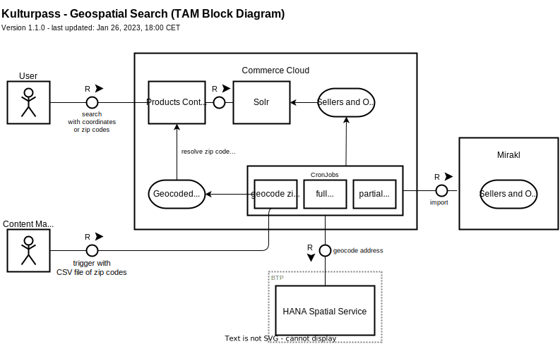

# Geospatial Search Concept

<!-- toc-start -->
<!-- GENERATED CONTENT -->
- [Overview]
- [Technical Building Blocks]
    - [TAM Block Diagram]

[Overview]: #overview
[Technical Building Blocks]: #technical-building-blocks
[TAM Block Diagram]: #tam-block-diagram
<!-- toc-end -->

## Overview

Commerce Cloud will support geospatial search to search for products and offers near the user's location. The user will have the option to search with their geo coordinates (provided by the device/browser) or by entering a zip code.

## Technical Building Blocks

The following technical building blocks are relevant:

- **Products Controller** - handles search requests from the client/user and passes the search query on to Solr's [spatial search](https://solr.apache.org/guide/8_8/spatial-search.html).

    If the query contains a zip code, the zip code is mapped to approximated geo coordinates via a lookup table.

- **Solr** - search index that supports [spatial search](https://solr.apache.org/guide/8_8/spatial-search.html) and calculates the distance.

    The data in Solr is indexed from the respective data storage (i.e. Sellers and Order).

- **Cron jobs** - replicate sellers and orders from Mirakl to Commerce Cloud. For new sellers or for sellers where the address has changed, the address is geocoded via HANA Spatial Service.

    An additional cron job can be triggered on demand with a CSV file of zip codes to geocode them via HANA Spatial Service and store them in the lookup table.

- **HANA Spatial Service** - provides an API to translate a (partial) address to geo coordinates.

### TAM Block Diagram

The building blocks are illustrates by the following TAM block diagram:

