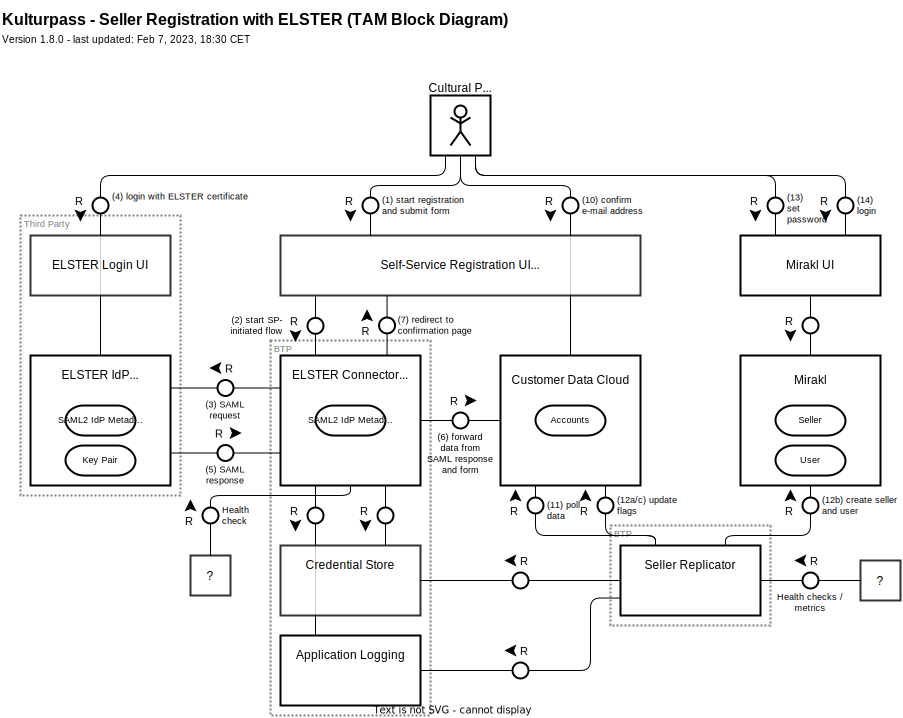
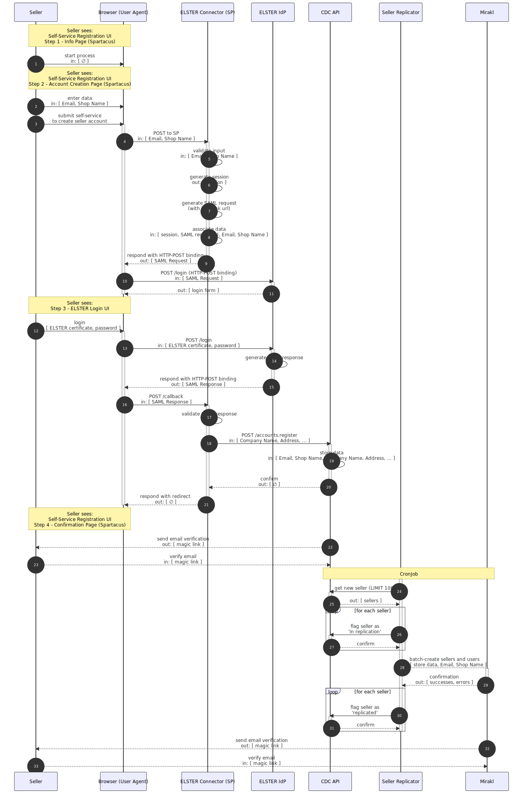

# Seller Registration with ELSTER

The ELSTER integration is relevant for the self-service registration of sellers (i.e. cultural providers). It ensures that only genuine businesses, that is those with a valid ELSTER certificate, can complete self-service registration and receive a seller account in Mirakl. The integration leverages the SAML2 protocol.

- [User Flow]
- [Technical Building Blocks]
- [Technical Flow]
- [Background Information]
    - [SAML2.0]

[User Flow]: #user-flow
[Technical Building Blocks]: #technical-building-blocks
[Technical Flow]: #technical-flow

[Background Information]: #background-information
[SAML2.0]: #saml20

## User Flow

Form a user perspective, the self-service registration consists of the following steps:

1. **Info Page** - users are informed about the self-service registration process and can start the process.

1. **Login to ELSTER** - users are forwarded to ELSTER as the first process step to log in with their ELSTER certificate. The user is informed that their information will be shared with Kulturpass. Afterwards, they are redirected back to the self-service registration.

1. **Account Page** - users enter email address and password for the user account that will be created in Mirakl. This user will also be the initial store administrator.

1. **Confirmation Page** - users receive a confirmation that the self-service registration was successful and that they can log in to Mirakl.

## Technical Building Blocks

The following technical building blocks are relevant for the seller registration with ELSTER:

- **Self-Service Registration UI** - web-based UI with info screen, form for account creation, and confirmation screen. This will be custom pages in the storefront (i.e. Spartacus). It interacts directly with the ELSTER Connector and CDC.

- **ELSTER Connector** - encapsulates SAML-related logic such as creating the SAML request, validating the SAML response, and forwarding the relevant attributes to Customer Data Cloud.

    The ELSTER Connector acts as the Service Provider in the SAML flow.

- **ELSTER Login UI** - web-based UI to log into ELSTER, usually with an ELSTER certificate.

- **ELSTER IdP** - SAML2 identity provider provides reliable information about the business such as name, legal entity, address.

    The ELSTER Connector acts as the Identity Provider in the SAML flow.

- **Customer Data Cloud** - receives the information from the ELSTER connector (via back-channel) to create an account.

- **Seller Replicator** - BTP service to replicate complete sellers from CDC to Mirakl to create a corresponding store and user.

### TAM Bock Diagram

The building blocks are illustrates by the following TAM block diagram:



## Technical Flow

The technical flow is illustrated by the following sequence diagram:



## Background Information

### SAML2.0

SAML2.0 describes a protocol for exchanging authentication and authorization data between the _Service Provider_ (SP) and an _Identity Provider_ (IdP). The data is exchanged in XML-based messages called _SAML Assertions_. A typical scenario starts with a _SAML Request_ sent from the SP to the IdP as a request for authentication (of the user) and is answered with a _SAML Response_ sent back to the IdP.

This [video](https://youtu.be/SvppXbpv-5k) is a good introduction to SAML2.0.

SAML Assertions can usually be sent via GET and POST from one party to the other:

- GET - the SAML Assertion is typically sent as a query parameter and represented as deflated base64-encoded string. Such requests can be server-initiated by setting the `Location` header of an HTTP response to trigger a redirect in the browser.

- POST - the SAML Assertion is typically sent as deflated base64-encoded string in the body of the request. Such requests can be server-initiated by responding with a dummy HTML response such as the following to trigger a client-side POST request:

    ```html
    <html>
      <body onload="document.forms[0].submit()">
        <noscript>
          <p><strong>Note:</strong> Since your browser does not support JavaScript, you must press the button below once to proceed.</p>
        </noscript>
        <form method="post" action="{url}">
          <input type="hidden" name="SAMLRequest" value="{assertion}" />
          <input type="submit" value="Submit" />
        </form>
        <script>document.forms[0].style.display="none";</script>
      </body>
    </html>
    ```
