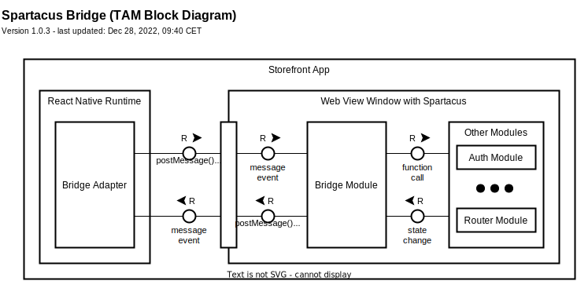
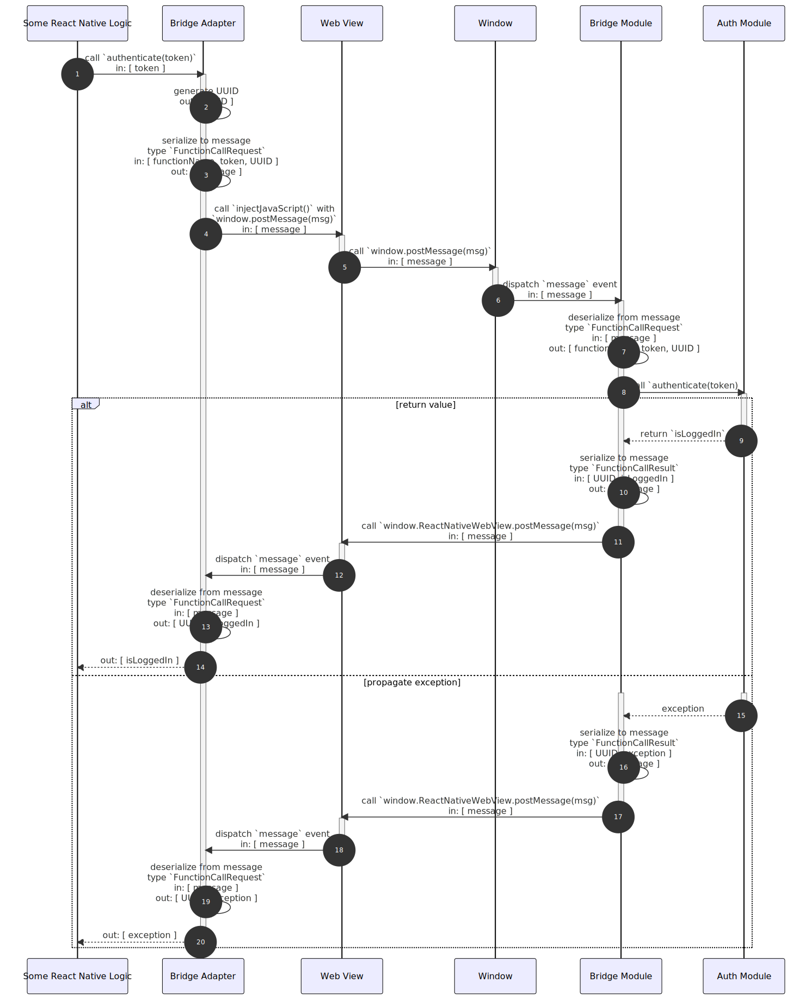
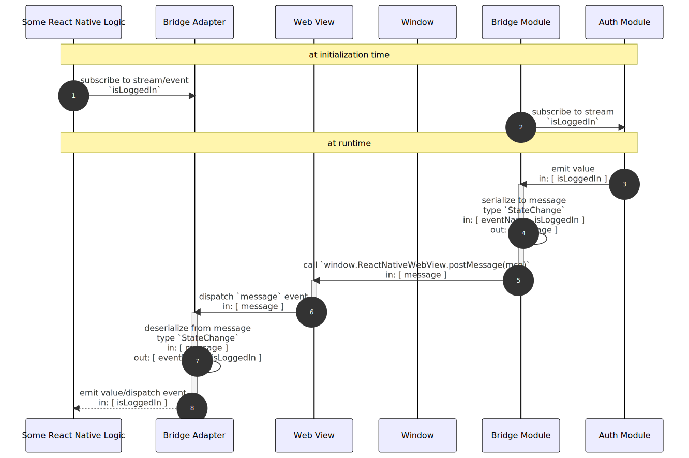

# Spartacus Bridge Concept

The Spartacus Bridge facilitates the integration between Spartacus and React Native when Spartacus is embedded as web view inside the app.

- [Overview]
- [Technical Building Blocks]
    - [TAM Block Diagram]
    - [Message Types]
- [Technical Flows]
    - [Function Call]
    - [State Change]
- [Embedded Mode]

[Overview]: #overview

[Technical Building Blocks]: #technical-building-blocks
[TAM Block Diagram]: #tam-block-diagram
[Message Types]: #message-types

[Technical Flows]: #technical-flows
[Function Call]: #function-call
[State Change]: #state-change

[Embedded Mode]: #embedded-mode

## Overview

The React Native app will embed the Spartacus storefront via web view for displaying the landing page and for the product search.

This includes use cases such as:

- communication from React Native to Spartacus to call functions, e.g. to authenticate a user or to trigger a navigation to a certain page

- communication from Spartacus to React Native to return the result of a function call

- communication from Spartacus to React Native to notify about certain events, e.g. navigation inside the web view

- hiding certain UI elements, e.g. header and footer, for running in _embedded mode_.

Communication is facilitated by using the [postMessage API](https://developer.mozilla.org/en-US/docs/Web/API/Window/postMessage).

## Technical Building Blocks

The following technical building blocks are relevant:

- **Web View** - browser environment with a single window that hosts the Spartacus storefront and is managed by React Native. It is assumed that [react-native-webview](https://github.com/react-native-webview/react-native-webview) will be used.

    React Native can communicate with the web view by calling `injectJavascript()`. This allows to execute arbitrary JavaScript inside the web view. Note that this is a one way communication channel that does not allow to pass anything back to React Native.

    The only way for JavaScript inside the web view can communicate back to React Native is by calling `postMessage` of the `window`'s `ReactNativeWebView` property.

    These two mechanisms are combined into a request/response protocol: React Native sends a _function call request_ via `injectJavascript()` and waits for a corresponding _function call result_ represented by a `message` event.

    For the sake of uniformity, the _function call request_ can also be represented as a `message` event on the `window`.

- **Bridge Module** - an Angular module in the Spartacus storefront that serves as facade for the Bridge Adapter to communicate with other modules in Spartacus.

    It subscribes to the `window`'s `message` event that represent _function call requests_ and calls corresponding functions of other modules. It returns the result of these function calls by emitting a _function call result via the `postMessage` API.

    It subscribes to relevant streams of other modules and propagates state changes via the `postMessage` API to React Native.

    It additionally detects whether the Spartacus storefront should run in _embedded mode_ or not.

- **Other Modules** - other Angular modules in the Spartacus storefront that are of interest for the app, such as the Auth Module and the Routing Module.

- **Bridge Adapter** - abstraction for all communication with the Web View and the Bridge Module.

    It exposes separate strongly typed functions for functions that are exposed in the Spartacus storefront through the Bridge Module.

### TAM Block Diagram

The building blocks are illustrates by the following TAM block diagram:

### Message Types

The concept requires the following message types:

| Type | Sender | Receiver | Attributes |
|---|---|---|---|
| Function Call Request | Bridge Adapter (React Native) | Bridge Module (Spartacus) | <ul><li>unique identifier of the call to correlate the Function Call Result</li><li>target module and function</li><li>arbitrary payload</li></ul> |
| Function Call Response | Bridge Module (Spartacus) | Bridge Adapter (React Native) | <ul><li>unique identifier of the call to correlate the Function Call Request</li><li>return value or exception</li></ul> |
| State Change | Bridge Module (Spartacus) | Bridge Adapter (React Native) | <ul><li>source module and stream</li><li>new value</li></ul> |

The message types must be serializable to JSON in order to be passed back and forth.

## Technical Flows

### Function Call

The following sequence diagram illustrates the flow of calling the (made-up) `authenticate` method of the `AuthModule` in Spartacus from React Native.

- **Step 1** - some piece of React Native logic calls the strongly typed async `authenticate` function of the Bridge Adapter with a `token`

- **Step 2** - the Bridge Adapter generates a UUID for this call. The UUID will be used in 13) on associate the message that includes the return value with the this function call.

- **Step 3** - the Bridge Adapter serializes the function name (i.e., `authenticate`), the arguments (i.e. `token`), and the UUID to a JSON string that will serve as the `message` for this function call.

- **Step 4** - the Bridge Adapter calls `injectJavaScript()` on the Web View to execute `window.postMessage(msg)` inside the Web View.

    This step transfers the message from React Native into the Web View. It causes the Bridge Adapter to await a `message` event with the same UUID.

- **Step 5 and 6** - the `message` event is dispatched on the global `window` object.

- **Step 7** - the Bridge Module is notified of the `window`'s `message` event and deserializes its payload with `JSON.parse()` to extract the function name (i.e., `authenticate`), the arguments (i.e. `token`), and the UUID.

- **Step 8** - the Bridge Module looks up which other module/function to call based on the function name and calls the function with the arguments.

- **success case** - if the function call does not raise an exception, the return value is propagated back to React Native:

    - **Step 10** - the Bridge Module serializes the return value (i.e. `isLoggedIn`) and the UUID to a JSON string that will serve as the `message` for the result.

    - **Step 11** - the Bridge Module calls `postMessage(msg)` of the Web View. This step transfers the message for the result from the Web View to React Native.

    - **Step 12** - the Web View dispatches the `message` event that is handled by the Bridge Adapter.

    - **Step 13** - the Bridge Adapter deserializes the payload with `JSON.parse()` to extract the return value (i.e. `isLoggedIn`) and the UUID.

        The UUID is used to associate the `message` event with the original function call and allows the Bridge Adapter to resolve the function call with the return value.

- **exception case** - if the function call raises an exception, it is propagated back to React Native:

    - **Step 16** - the Bridge Module serializes the exception and the UUID to a JSON string that will serve as the `message` for the result.

    - **Step 17** - the Bridge Module calls `postMessage(msg)` of the Web View. This step transfers the message for the result from the Web View to React Native.

    - **Step 18** - the Web View dispatches the `message` event that is handled by the Bridge Adapter.

    - **Step 19** - the Bridge Adapter deserializes the payload with `JSON.parse()` to extract the exception and the UUID.

        The UUID is used to associate the `message` event with the original function call and allows the Bridge Adapter to resolve the function call with an error.

### State Change

The following sequence diagram illustrates the flow of propagating the state change of the (made-up) `isLoggedIn` observable/event of the `AuthModule` in Spartacus to React Native.

- **Step 1** - some piece of React Native logic subscribes to the `isLoggedIn` stream/event of the Bridge Adapter.

- **Step 2** - the Bridge Module subscribes to the `isLoggedIn` stream of the Auth Module.

- **Step 3** - the Auth Module emits a state change to the `isLoggedIn` stream.

- **Step 4** - the Bridge Module serializes the stream name (i.e. `isLoggedIn`) and the payload (i.e. `true`) and to a JSON string that will serve as the `message` for the event.

- **Step 5** - the Bridge Module calls `postMessage(msg)` of the Web View. This step transfers the message for the state change from the Web View to React Native.

- **Step 6** - the Web View dispatches the `message` event that is handled by the Bridge Adapter.

- **Step 7** - the Bridge Adapter deserializes the payload with `JSON.parse()` to extract the stream name (i.e. `isLoggedIn`) and the payload (i.e. `true`).

- **Step 8** - the Bridge Adapter emits the state change/dispatches the event.

## Embedded Mode

The use case that the Spartacus Storefront runs in a web view inside the React Native app is referred to as running in _embedded mode_.

The embedded mode can be auto-detected checking for the existence of `window.ReactNativeWebView`.

The embedded mode hides certain UI elements such as header, footer, or navigation elements, because they are provided by the surrounding app. This can be done by setting a CSS class for the embedded mode on one of the top-most HTML elements and hiding certain elements based on the presence of that CSS class.
