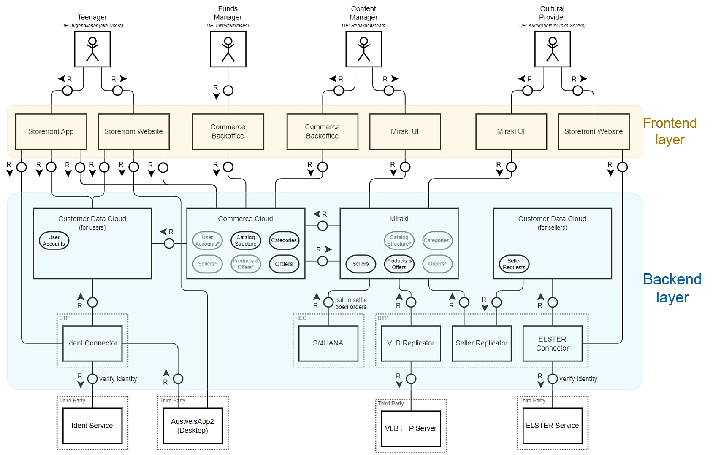

# KulturPass - Architecture

The basic architecture of the KulturPass consists of two development layers:

- Frontend systems and applications, including the end user mobile app
- Backend systems and processes including the necessery connectors and replicators to facilitate integration of internal or external services
Additionally, a few third-party products, services or interfaces are leveraged, primarily in the context of identity verification.

This documentation covers the KulturPass mobile app part only. However, those parts of other components and systems that affect the app implementation will be explained as well.
Hint: Several mentioned functions refer to specific _roles_ in the KulturPass context. To understand the differences, please check a brief description of [Roles and Actors](../project-documentation/project-roles-and-actors.md) in the _Project Documentation_.

## Frontend layer

### KulturPass mobile app

As described in the [Project Documentation](../project-documentation/project-objectives.md) the young people in the role of the **consumer** interact on the cultural marketplace with the vendors of the cultural goods and services. In order to browse the offers and to order their goods, tickets, services... people use the **KulturPass app**. In the documentation we will dive deeper into the functions and implementation details, but here is a quick introduction to the main characteristics of the app:

- Provided for Android and iOS operating system[^1]
- Implementation in React Native, a framework for creating UIs that also allows you to use React to create native applications for Android and iOS
- Makes usage of geolocation services for a smart user experience regarding offers in the nearby neighborhood 
- Offers at least the following functions:
  - Identification[^2] and registration of a user (leveraging identity verification services)
  - Run in portrait mode
  - Manage/maintain the user's preferences for cultural goods and services
  - Select and drop down menu in product details
  - Reserve a ticket, cultural good, service, voucher etc. based on the available credit line
  - Receive notifications from the vendor (depending on the vedor's capability to push notifications)
  - Return unused reservations, goods, tickets etc. according to the terms and conditions of the vendor
  - Easily check the available credit line

### Web Storefront

The web storefront

- Acts as the layer in front of SAP Customer Data Cloud (CDC) and of SAP Commerce Cloud
- Implements _Spartacus_ (Composable Storefront) UI elements for handling functions addressing the SAP Customer Data Cloud (CDC) and SAP Commerce Cloud on the backend side of the solution.
- Major functions of the web storefront:
  - Allows access to maintain user account details and credentials for the KulturPass solution
  - Receive and handle events

### Mirakl UI

For the KulturPass the Mirakl solution provides the shop capability to create the cultural marketplace. Subsequently, the Mirakl UI

- Provides an interface to vendors (on different levels) to administer their shops
- Offers the interface to content managers to maintain the categories, catalog structures, account/shop attributes etc. for the marketplace
- Runs also as the main interface for content managers
- To accomplish these tasks, the Mirakl UI features the following functions:
  - Support shop and account creation
  - Provide configurable registration and administration forms to collect shop attributes and properties
  - Enter and maintain (lists of) products and offers manually or via CSV file upload
  - Allow manual activities (order creation, acceptance, "processing", finalizing/closing)
  - Retrieve reports (transaction overview, shop activity etc.) from the marketplace

### Commerce Backoffice UI

Equivalent to the Mirakl UI view on the cultural marketplace, the SAP Commerce Cloud Backoffice UI system covers the commercial view for the transaction processing with the following properties:

- Web-based UI for the SAP Commerce Cloud
- Serves the following functions for funds manager and content manager
  - Maintain and validate catalog structure and categories with the respective properties
  - Retrieve reports about user accounts, vendor accounts, products, offers, and transactions  

## Backend layer

### SAP Commerce Cloud (CC)

The Commerce Cloud component in the KulturPass solution serves as the e-Commerce system. Therefore, this system ist the leading system, where data and catalog structures and categories are defined and maintained. Those technical details will be regularly synchronized with the Mirakl marketplace system. As soon as the consumer reserves an offer in the mobile app, the Mirakl system triggers an order document creation in SAP Commerce Cloud. As a result, the order process is manifested by an order with unique identifier and with a specific recipient.

Technical details of CC:

- Mainly implemented in Java
- Performs as both PaaS and SaaS
- Runs on MS Azure cloud computing service
- To find out more product details, please check the [SAP Cloud Commerce website](https://www.sap.com/germany/products/crm/commerce-cloud.html)

### SAP Commerce Marketplace Management by Mirakl

The SAP Commerce Marketplace Management by Mirakl solution represents the cultural marketplace, where the shop orchestration happens and where the orders are processed by the vendors. New vendors need to be onboarded[^3] on SAP Commerce Marketplace Management by Mirakl first. Once this step is successfully performed, the vendor needs to enter the shop parameters and the products and offers.

Technical details of SAP Commerce Marketplace Management by Mirakl:

- Design to run B2B and B2C buisinesses on a SaaS model
- To find out more product details, start research on the [Mirakl website](https://www.sap.com/germany/products/crm/commerce-marketplace-management.html)

### SAP Customer Data Cloud (CDC)

To manage user accounts (meaning: KulturPass mobile app users) and to manage user consents regarding their shared data, with SAP Customer Data Cloud the KulturPass solution runs a dedicated system. This instance is the leading system for user accounts. All other components of the solution that need to validate or process user acount data, need to connect with CDC.
Note: Vendor accounts (cultural providers) and complementary accounts to operate the KulturPass business are _not_ stored, managed, and maintained in the CDC system.

Technical details of CDC:

- Designed as SaaS solution
- Runs on AWS and Azure hyperscaler infrastructure on two different european locations.
- Syncronization of user account data with SAP Commerce Cloud (CC) component
  
### SAP S/4HANA

For the orchestration of the financial aggregation and payment processes, we make usage from the SAP S/4HANA capabilities. Technical implementation will not be covered here, but we are going to explain the finance processes in more detail in the [Processes and Functions](../project-documentation/project-processes-and-functions.md) part of the _Project Documentation_.

To find out more about SAP S/4HANA, check out the information on the [S/4HANA website](https://www.sap.com/germany/products/erp/s4hana.html)

### Connectors

On the KulturPass platform, connectors are used to encapsulate external third-party services and systems. They are required to complete the processes on the platform. Basically, at the KulturPass marketplace connectors verify identity to authorize admission. See section [Technical Processes/Functions](technical-processes-and-functions.md) for a more detailed technical documentation of the connector function. If you are interested in the organizational embedding of the connectors during registration you may check the explanations in the [Project Processes/Functions](../project-documentation/project-processes-and-functions.md).

#### Ident Connector

To verify whether or not the user is eligible to receive KulturPass credit, the ident connector is implemented. This connector utilizes the eID service and infrastrutcure of the Bundesdruckerei. This approach allows on the one hand to get proof of identity of the user. On the other hand, we are able to perform an age check based on the atributes.
For identification, an NFC-capable ID is currently required, other approaches to proof identity will be evaluated for later implementation, though.

Find out more in the next section about the [user identification concept](user-identification-concept.md).

#### ELSTER Connector

The ELSTER connector is implemented to facilitate the formal registration of a vendor on the KulturPass marketplace. To validate the business (or the vendor, respectively) the cultural provider needs to provide a digital certificate that is otherwise used to submit tax declarations (so called _Organisationszertifikat_). Contrary to personal certificates, they are not linked to individual persons, but to an organization under tax law (corporate entity, company, association).

Back to [Technical Documentation](README.md)

Back to the [Start of Documentation](../README.md)

[^1]: Other operating systems may follow on request of the client and the available capacity
[^2]: The process of identification verification and the requirements will be described in a separate section of the documentation.
[^3]: The Onboarding topic for vendors will be documented in an extra chapter of this documentation.
