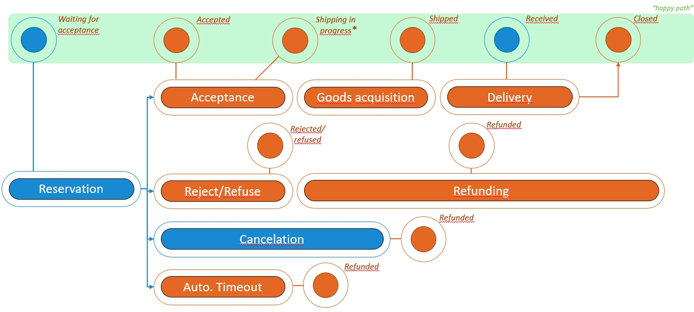

## Technical Order Management processes

During the order management and fulfillment process, the transaction passed several states; either predefined by the Mirakl marketplace solution or intrinsically created by the meaning of attributes/custom fields of an order. The utilized stages and the possible transitions are shown in the following diagram and explained afterwards.
<!-- hier Bilder und Beschreibung des Order management und Teile der API doku einfügen -->

Back to [Technical documentation](README.md)

Back to [start of project documentation](../README.md)
