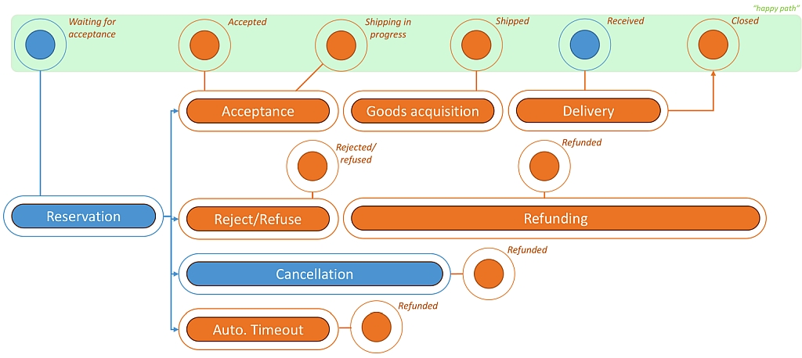

## Technical Order Management processes

During the order management and fulfillment process, the transaction passed several states; either predefined by the Mirakl marketplace solution or intrinsically created by the meaning of attributes/custom fields of an order. The utilized stages and the possible transitions are shown in the following diagram and explained afterwards.
<!-- hier Bilder und Beschreibung des Order management und Teile der API doku einfügen -->

_Waiting for acceptance_ - Each order transaction starts with this status. Basically, this status reflects, that an order was triggered by an teeanger and the respective offer value will be blocked from the users budget. Also, the order transaction object now is generated, residing in the Mirakl system. This order comes with a set of details describing the tansaction. From the processing perspective, now the turn is on the shop to fulfill this reservation. The shop gets notified by the Mirkl system.

_Accepted_ - The respective shop now may or may not accept the incoming order. In case the shop accepts the reservtion, the fulfillment process starts with this acceptance.

_Rejected_ - There might be a good reason, not to fulfill an incoming reservation. In that case, the shop owner can reject the order transaction actively. The transaction then will stop here and the teenager user gets notified. It is importand to understand, that the shop owner has to do one more step: Once the order was rejected, the blocked budget has to be released by performing the "full refund" task (either manually or via API[^1]). Subsequently, the final state of the rejected transaction should be _Refunded_.

If the teenager decides to cancel a reservation at an early stage of the transaction, the shop owner will get notified as well. Obviously, there is no need to fulfill the transaction anymore. Therefore, the only task to perform is the "full refund", with leads to the final state _Refunded_ for the original order transaction.

In the rare case that the addressed shop (that received the reservation) does not answer the transaction _Waiting for acceptance_, the KulturPass marketplace operations teams assumes that the vednro shop is currently out of service. That's why, 
the order transaction will timeout automatically after 5 days waiting for acceptance. In that case, Mirakl is customized to automatically reject the transactionand will  refund the offer values to the teenagers KulturPass budget. Additionally, the marketplace control logs a timeout event for that shop[^2]. 

_Shipping in progress_ - Once, an order transaction was accepted by the respective shop, the fulfillment process starts. The shop may need to acquire the ordered article first from a provider (supplier or dealer) first. Regardless of the need of that kind of shipping, in Mirakl the transaction will be set automatically to status _Shippig in progress_; there is no need to do that on the shop side. However, this status is a precondition for the next important state:

_Shipped_[^3] - By setting this status on a transaction in Mirakl, the shop owner informs the ordering teenager that the reserved artikel is ready to be picked up. This status is important for vaious reasons:
- The ordering teenager now knows that the article can be picked up in the physical store.
- This state-transition starts the timer for the pick-up. if te atricle was **not** picked up within 10 days from the "Shipped" date/time, the order needs to be reversed and refunded.
- As soon as the _Shipped_ status was setr by the shop, the button for "Cancelation" in the transaction details screen of the users KulturPass app disappears, so the teeanager is unable to cacled the transaction any longer.  
  
##
Back to [Technical documentation](README.md)

Back to [start of project documentation](../README.md)

[^1]: **Remark:** State-transistions can either be performed manually or by API programming. In any case, the respective change of the transition will be recorded in the transaction history.
[^2]: This is part of the process quality control: If the event log counts 5 times an automatic transaction rejection, we assume the shop is no longer in service - so, the shop will be temporarily disabled on the marketplace. This can be reverted if the shop owner takes control again and contacts the foundation _Digitale Chancen_ to discuss the operational issues.
[^3]: The German transalation in Mirakl is "Versandt": Unfortunately, there is no way to change this translation by customizing,  to a more appropriate translation like "ready for pick-up"

