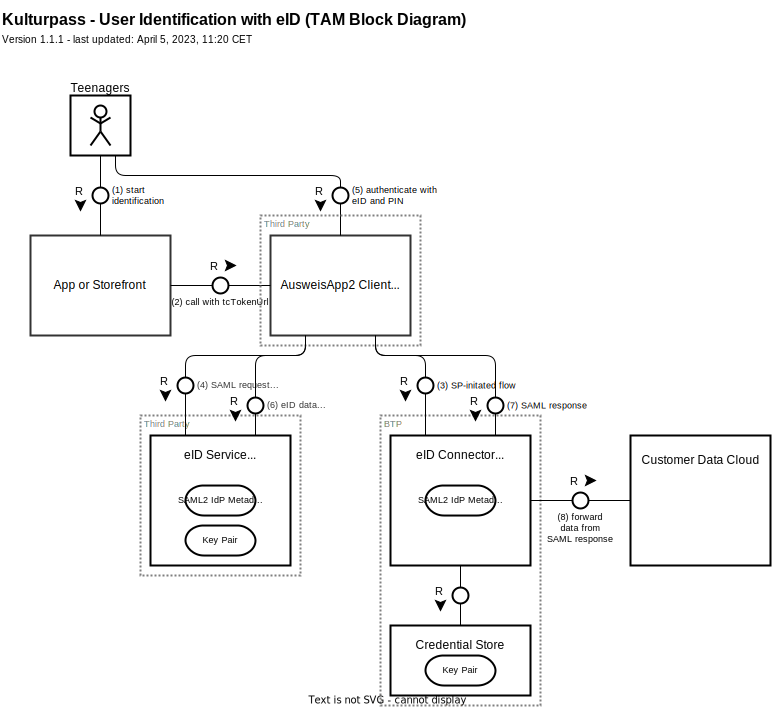
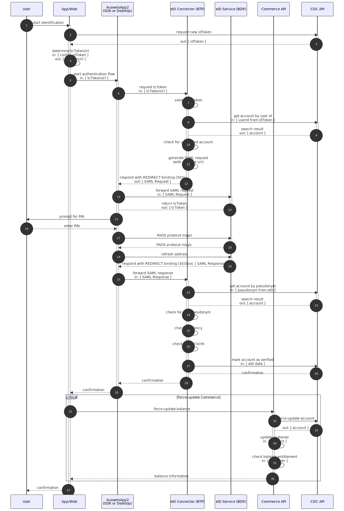

# User Identification with eID

User identification is relevant for claiming virtual balance. It ensures that users can claim their virtual balance only at a specific age, only with a German residence, and only once per person.

<!-- toc-start -->
<!-- GENERATED CONTENT -->
- [Overview]
- [Technical Building Blocks]
- [TAM Bock Diagram]
- [Technical Flow]

[Overview]: #overview
[Technical Building Blocks]: #technical-building-blocks
[TAM Bock Diagram]: #tam-bock-diagram
[Technical Flow]: #technical-flow
<!-- toc-end -->

## Overview

The user identification with eID allows users to verify their identity with their eID. This can either be a German ID card, a German electronic residence permit, or an eID card for EU/EWR citizen. Technically, these different documents all work the same.

Technically, the flow is based on SAML where our eID Connector acts as SAML service provider and the eID Service acts as SAML IdP.

The "raw"/encrypted data and the PIN of the eID never reach any of our systems. They are processed only by the AusweisApp2 SDK/desktop app and the eID Service.

As a result of the process, a user's CDC account is marked as _idVerified_ and _residenceVerified_.

## Technical Building Blocks

The following technical building blocks are relevant for the user identification with eID:

- **App or storefront** - mobile app or web-based UI with info screen that acts as the starting point for the identification process.

- **AusweisApp2 Client** - in the mobile app scenario, the client is embedded into the app via the AusweisApp2 SDK in which case the respective UIs will be provided by the app.

    In the desktop scenario, the client is the AusweisApp2 desktop app that needs to be installed and started on the local machine.

- **eID Connector** - encapsulates SAML-related logic such as creating the SAML request, validating the SAML response, and forwarding the relevant attributes to CDC

- **eID Service** - SAML2 identity provider, providing the data from the eID document.

    It is a third-party service from the Bundesdruckerei (BDR)

- **Customer Data Cloud** - receives the information from the eID Connector and updates the corresponding user profile (via back-channel).

## TAM Bock Diagram

The building blocks are depicted by the following TAM block diagram:

## Technical Flow

The technical flow is illustrated by the following sequence diagram:

Back to [KulturPass DE - Technical Documentation](README.md)

Back to [KulturPass DE documentation](../README.md)
